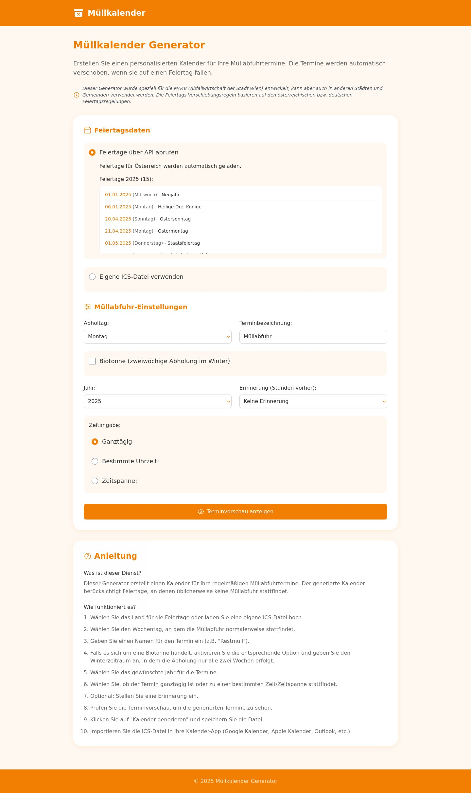

# Müllkalender Generator

## 🔗 [muellkalender.netlify.app](https://muellkalender.netlify.app)



Web-App zur Erstellung von Müllabfuhr-Kalendern im ICS-Format. Primär für die **Wiener Müllabfuhr (MA48)**, nutzbar auch mit generischen Feiertagsregeln oder eigenen ICS-Quellen.

## Funktionen

- **Profile**: `ma48-vienna`, `generic`, `custom`
- **Feiertagsverschiebung**: Zählt betriebliche Sperrtage in der Woche und verschiebt nachfolgende Abholungen (Samstag als Nachholtag, Sonntag nicht)
- **MA48-Sonderregeln**: Jahrweise Overrides (z. B. Weihnachten 2026: 25./26.12. offen). Unverifizierte Jahre nutzen die Standardregel inkl. UI-Hinweis
- **Feiertagsquellen**: Nager.Date für AT/DE, lokaler Fallback (ohne Karfreitag als AT-Feiertag), eigene ICS-Datei/URL
- **Biotonne**: 14-Tage-Rhythmus über ein Referenzdatum innerhalb des Winterzeitraums
- **Zeiträume**: ganzes Jahr oder nur zukünftige Termine (Standard)
- **Erinnerungen**: Stunden → korrekte VALARM-Trigger in Sekunden
- **ICS-Export**: Floating local times, damit `08:00` in Kalender-Clients als 08:00 erscheint

## Architektur

Die Abfuhrlogik liegt ausschließlich in `lib/calendar/buildSchedule.js`. Browser-Vorschau und `/api/generate-ics` nutzen dieselbe pure Domain-Funktion.

```text
lib/calendar/
  buildSchedule.js      # zentrale Terminberechnung
  resolvePickup.js      # Feiertags-/Override-Verschiebung
  bioWaste.js           # Winter-14-Tage-Rhythmus
  rules/ma48.js         # MA48-Overrides pro Jahr
  ics/generateIcs.js    # ICS-Erzeugung
  ics/parseIcs.js       # gemeinsamer ICS-Parser (node-ical)
```

## Zeitzonen

Standard: `Europe/Vienna` (AT/MA48), `Europe/Berlin` (DE).  
Timed Events werden als **floating local times** geschrieben (kein serverabhängiges UTC). Ganztägige Termine nutzen `VALUE=DATE` und rutschen nicht auf den Vortag.

## MA48-Sonderregeln

Einträge in `lib/calendar/rules/ma48.js`, z. B. 2026:

- `2026-12-25` / `2026-12-26` → `service: open`
- Metadaten: `verified`, `verifiedAt`, `sourceLabel`

Fehlt die Verifikation für ein Jahr, gilt die gesetzliche Standardregel; das UI warnt ausdrücklich.

## Entwicklung

```bash
npm install
npm run dev      # http://localhost:3000
npm test
npm run lint
npm run build
```

## API

| Endpoint | Beschreibung |
|----------|----------------|
| `GET /api/holidays?country=AT\|DE&year=YYYY` | Feiertage inkl. `source` / `degraded` |
| `POST /api/generate-ics` | ICS aus validiertem Request (Zod) |
| `GET /api/fetch-ics?url=…&year=YYYY` | HTTPS-ICS-Proxy mit SSRF-Schutz |
| `POST /api/parse-ics` | Gemeinsamer ICS-Parser für Datei-Uploads |

## Einschränkungen

- MA48-Sonderregeln sind nur für Jahre mit `verified: true` hinterlegt
- Regionale DE-Feiertage (nur bundesweite Basis im Fallback) können abweichen
- Wiederkehrende ICS-Events werden nur begrenzt expandiert

## Lizenz

ISC
